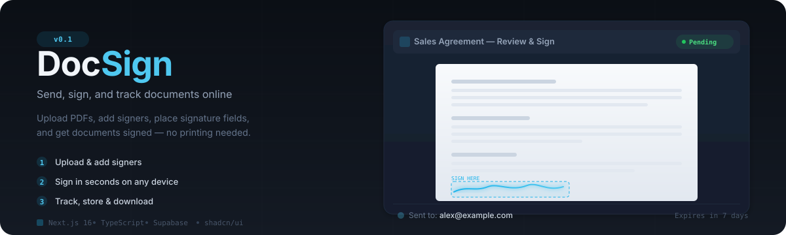

<p align="center">
  
</p>

<p align="center">
  <a href="#features"></a>
  <a href="#tech-stack"></a>
  <a href="#tech-stack"></a>
  <a href="#tech-stack"></a>
  <a href="./LICENSE"></a>
</p>

---

**DocSign** is a digital document signing platform for two-person signing workflows. Upload a PDF, assign signers, place signature fields, and track the status — all from one dashboard. Inspired by DocuSign, built for simplicity.

---

## Features

- **Upload & send** — Upload PDFs, add signer details, and send signature requests via email.
- **Signature field placement** — Drag signature fields onto document previews with pixel-accurate positioning.
- **Sign on any device** — Signers open a secure link on desktop or mobile. QR code handoff for mobile signing.
- **Dashboard & history** — Track pending, signed, and completed documents with search and filters.
- **Template library** — Reusable templates for NDAs, contracts, rental agreements, and more.
- **Audit trail** — Every signature is logged with IP address, timestamp, and action for compliance.
- **Expiration policy** — Unsigned documents auto-void after 7 days.
- **Internationalization** — Multi-language support via next-intl.
- **Dark mode** — Built-in light/dark theme toggle.

## How it works

1. **Upload a PDF** — Drop your document and add signer names and email addresses.
2. **Place fields** — Drag signature, date, and text fields to the right positions on the document.
3. **Send** — Each signer receives a secure email link. They review and sign on desktop or mobile.
4. **Track** — See who has signed, who hasn't, and download completed PDFs with the audit trail.

## Tech stack

| Layer | Technology |
|---|---|
| Framework | [Next.js 16](https://nextjs.org) (App Router) |
| Language | [TypeScript](https://www.typescriptlang.org) |
| Styling | [Tailwind CSS v4](https://tailwindcss.com) + [shadcn/ui](https://ui.shadcn.com) |
| Auth & Database | [Supabase](https://supabase.com) (PostgreSQL, Row Level Security) |
| PDF Processing | [pdf-lib](https://pdf-lib.org) + [react-pdf](https://react-pdf.org) |
| Signature Capture | [react-signature-canvas](https://www.npmjs.com/package/react-signature-canvas) |
| Email | [Resend](https://resend.com) |
| Internationalization | [next-intl](https://next-intl.dev) |
| UI Icons | [Lucide React](https://lucide.dev) |

## Getting started

### Prerequisites

- Node.js 20+
- A [Supabase](https://supabase.com) project (for auth, database, and storage)
- A [Resend](https://resend.com) API key (for sending signature emails)

### Install & run

```bash
# Clone the repository
git clone https://github.com/alinme/docsign.git
cd docsign

# Install dependencies
npm install

# Set up environment variables
cp .env.example .env.local
```

### Environment variables

```env
# Supabase (required)
NEXT_PUBLIC_SUPABASE_URL=your_supabase_url
NEXT_PUBLIC_SUPABASE_ANON_KEY=your_supabase_anon_key
SUPABASE_SERVICE_ROLE_KEY=your_service_role_key

# Resend (required for email notifications)
RESEND_API_KEY=your_resend_api_key

# Email base URL for local testing
EMAIL_BASE_URL=http://localhost:3000

# App URL (used in email links)
NEXT_PUBLIC_APP_URL=http://localhost:3000
```

### Start development

```bash
npm run dev
```

Open [http://localhost:3000](http://localhost:3000) in your browser.

### Build for production

```bash
npm run build
npm start
```

## Database setup

DocSign uses Supabase with Row Level Security. The required schema includes:

- **`documents`** — Stores document metadata, status, and file references
- **`signers`** — Signer information and signing status per document
- **`signatures`** — Captured signature data and timestamps
- **`audit_logs`** — IP, action, and timestamp for compliance
- **`templates`** — Reusable document templates
- **`profiles`** — User profiles linked to Supabase Auth

Apply the migrations from `supabase/migrations/` after linking your Supabase project:

```bash
npx supabase link --project-ref your_project_ref
npx supabase db push
```

## Project structure

```
src/
├── actions/          # Server actions (documents, signatures, auth)
├── app/              # Next.js App Router pages
│   ├── [locale]/     # Internationalized routes
│   │   ├── auth/     # Login, signup, password reset
│   │   └── (dashboard)/  # Authenticated dashboard pages
│   └── sign/[id]/    # Public signing page
├── components/       # React components
│   ├── ui/           # shadcn/ui primitives
│   ├── layout/       # Dashboard shell, sidebar, navbar
│   ├── landing/      # Marketing landing page
│   └── auth/         # Auth-related components
├── i18n/             # next-intl configuration
└── lib/              # Utilities, Supabase clients, PDF helpers
```

## License

[MIT](./LICENSE) — feel free to use, modify, and distribute.
